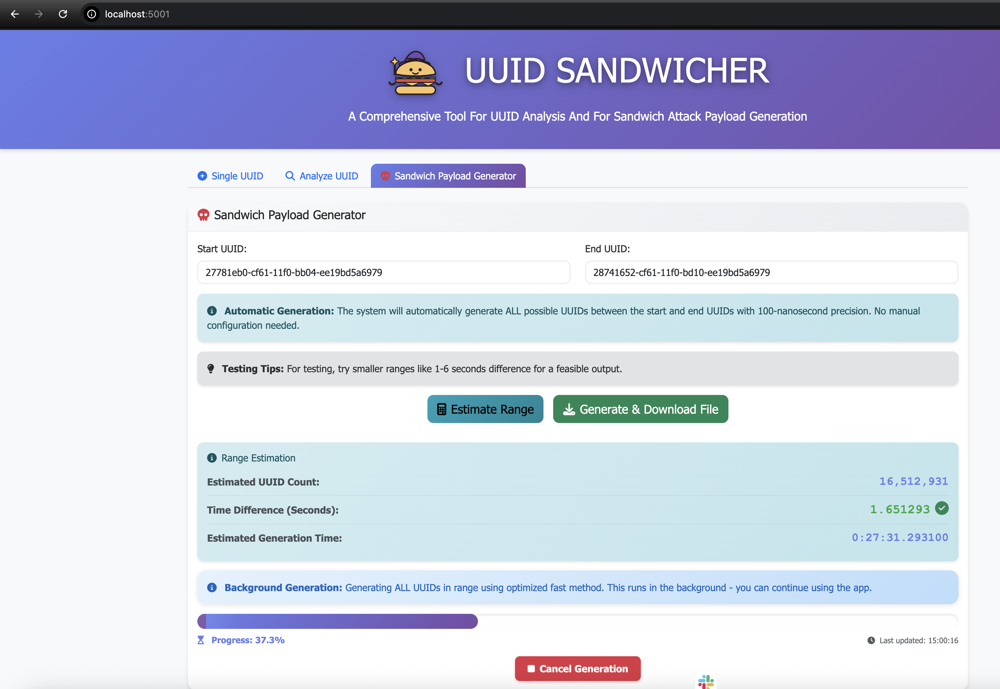

# UUIDv1 SANDWICHER

A comprehensive web-based tool for generating, analyzing, and exploiting UUID version 1 (time-based) vulnerabilities. Perfect for security researchers, developers, and penetration testers working with UUID v1 enumeration attacks.

## 🎯 Features

- **🔍 UUID Analysis**: Deep analysis of UUID v1 including timestamp extraction, MAC address identification, and security vulnerability assessment
- **⚡ Single UUID Generation**: Generate individual UUID v1s with current timestamp
- **📊 UUID Range Generation**: Generate all UUIDs between two given UUID v1s with 100-nanosecond precision
- **🎯 Sandwich Attack Payload Generator**: Create attack payloads for UUID enumeration vulnerabilities
- **📈 Range Estimation**: Analyze time differences and estimate generation time before processing
- **🔐 Security Analysis**: Identify sandwich attack possibilities and vulnerable patterns
- **🔗 Vulnerable Lab Integration**: Direct links to hands-on practice labs

## 🚀 Quick Start

### Prerequisites

- Python 3.7 or higher
- pip (Python package installer)

### Installation

1. **Clone the repository**:
   ```bash
   git clone https://github.com/harikrishnankv/UUIDv1_Sandwicher.git
   cd UUIDv1_Sandwicher
   ```

2. **Run the installation script**:
   ```bash
   chmod +x install.sh
   ./install.sh
   ```

   The installation script will automatically:
   - Detect and verify Python 3 installation
   - Install/upgrade pip if needed
   - Create a virtual environment
   - Install all required dependencies

### Running the Application

Simply run the start script:

```bash
chmod +x start.sh
./start.sh
```

The application will start on **http://localhost:5001**



> **Note**: If port 5001 is already in use, the script will prompt you to kill the existing process or you can manually stop it.

## 📖 Usage Guide

### Single UUID Generation

1. Navigate to the **"Single UUID"** tab
2. Select UUID version (v1, v2, v3, or v4)
3. Click **"Generate UUID"**


### UUID Analysis

1. Go to the **"Analyze UUID"** tab
2. Enter any UUID in the input field
3. Click **"Analyze"** to view:
   - Timestamp and date/time (UTC and IST)
   - Version and variant information
   - MAC address (node identifier)
   - Clock sequence details
   - Security vulnerability assessment
   - Sandwich attack possibility analysis
   - Links to Articles and vulnerable labs for practice

### Sandwich Payload Generator

1. Navigate to the **"Sandwich Payload Generator"** tab
2. Enter a **Start UUID** (your target UUID)
3. Enter an **End UUID** (the UUID you want to enumerate to)
4. Click **"Estimate Range"** to see:
   - Total number of UUIDs in range
   - Time difference between UUIDs
   - Estimated generation time
5. Click **"Generate & Download File"** to create the payload file
6. The system will generate all UUIDs in the range and provide a download link

**Pro Tip**: For effective sandwich attacks, use UUIDs within 1-3 seconds of each other for optimal payload size.

### Example Workflow

1. **Analyze a target UUID**:
   - Input: `27781eb0-cf61-11f0-bb04-ee19bd5a6979`
   - Review the analysis to understand timestamp and structure

2. **Generate attack payload**:
   - Start UUID: `27781eb0-cf61-11f0-bb04-ee19bd5a6979`
   - End UUID: `28741652-cf61-11f0-bd10-ee19bd5a6979`
   - Download the generated UUID list

3. **Use the payload**:
   - Use the generated UUIDs for enumeration attacks
   - Test against vulnerable applications using UUID v1

## 🛠️ Troubleshooting

### Port Already in Use

If you see "Port 5001 is already in use":
- The start script will automatically detect and offer to kill the process
- Or manually stop it: `lsof -ti:5001 | xargs kill -9`

### Python/Python3 Issues

The installation script automatically detects:
- `python3` command
- `python` command (if it's Python 3)
- Falls back appropriately

### Pip Version Issues

The installation script will:
- Automatically upgrade pip to the latest version
- Handle pip/pip3 command differences
- Install dependencies in an isolated virtual environment

### Virtual Environment Issues

If you encounter virtual environment errors:
```bash
rm -rf venv
./install.sh
```

## 📚 Use Cases

- **Security Research**: Analyze UUID v1 vulnerabilities in applications
- **Penetration Testing**: Generate enumeration payloads for UUID-based systems
- **Development**: Understand UUID v1 structure and timestamp extraction
- **Education**: Learn about UUID vulnerabilities and sandwich attacks

## 🔗 Related Resources

- **Vulnerable Lab**: 
   Practice UUID enumeration attacks with our [File Storage Lab](https://github.com/harikrishnankv/file-storage-lab)
- **Article**: [Sandwich Attack UUID v1](https://medium.com/@ibm_ptc_security/a114e3a8b6c4)


## 👥 Credits

- **Sruthi M** - [LinkedIn](https://www.linkedin.com/in/sruthi-m-48600866/)
- **Ashiq K** - [LinkedIn](https://www.linkedin.com/in/ashiq-k-9308a328/)
- **Harikrishanan Kv** - [LinkedIn](https://www.linkedin.com/in/harikrishnan-kv-85738914a/)

---
## 👥 Thanks and Inspiration
- **Lupin**- [X](https://x.com/0xLupin)


## ⚠️ Disclaimer

This tool is intended for educational and authorized security testing purposes only. Users are responsible for ensuring they have proper authorization before testing UUID vulnerabilities on any system.


